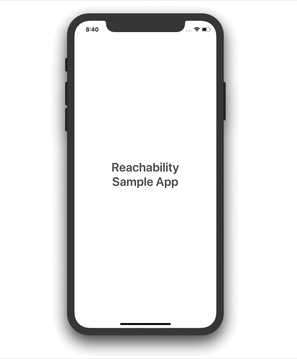

# Reachability
A simple implementation to check if your app is connected to the internet with just a few lines of code. In this project, I have also added an animated warning message to alert the user about their inability to connect to the internet.

